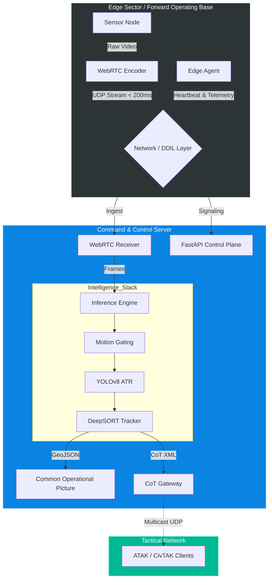

# Sentinel: Distributed Tactical ISTAR Platform

**A distributed Command & Control (C2) node for real-time situational awareness in bandwidth-constrained edge environments.**

## Mission Statement

**Sentinel** is a modular surveillance architecture designed to bridge the gap between commercial IoT hardware and military-grade Command & Control (C2) systems. Unlike traditional security dashboards, Sentinel is built for **DDIL** (Denied, Disrupted, Intermittent, Limited) environments, decoupling **Perception** (Edge Nodes) from **Cognition** (C2 Server).

It enables sub-200ms video streaming, edge-computed Automated Target Recognition (ATR), and seamless interoperability with tactical networks via **Cursor-on-Target (CoT)**.

---

## System Architecture

Sentinel utilizes a **Split-Plane Architecture** to optimize network throughput. 
* **Data Plane (UDP):** High-volume video traffic uses WebRTC to prevent head-of-line blocking.
* **Control Plane (TCP):** Critical telemetry and hardware commands use reliable REST/WebSockets.



## Key Capabilities

### 1. "Silent Watch" (DDIL Resilience)
When network connectivity is lost (`Connection State: failed`), the Edge Node automatically enters **Silent Watch** mode.
-   **Behavior**: It continues to sample the sensor locally, running lightweight background subtraction algorithms.
-   **Buffering**: Significant motion events (>5% change) are logged to a secure on-device buffer (`pending.txt`).
-   **Sync**: (Future Roadmap) Logs are replayed to the C2 server upon reconnection.

### 2. "Digital Twin" Asset Management
The entire operational environment is defined in `config/site_manifest.yaml`, serving as the **Single Source of Truth**.
-   **Schema**: Defines Assets (Cameras), Spatial Data (Lat/Lon/Heading/FOV), and Network parameters.
-   **Architecture**: The backend `AssetManager` parses this manifest to generate the map's geofences and sensor cones dynamically.

### 3. Tactical Symbology
The C2 Dashboard visualizes threats using standard tactical cues:
-   **Blue Cone**: Sector Secure (Idle).
-   **Red Pulse**: Threat Detected (YOLOv8 Identification).
-   **FOV Representation**: Cones accurately reflect the sensor's physical Field of View and Orientation.

---

## Quick Start

### Prerequisites
-   Python 3.10+
-   Webcam (for Edge Node)
-   Linux / macOS

### Installation
```bash
# Clone the repository
git clone https://github.com/your-org/sentinel.git
cd sentinel

# Install dependencies
pip install -r requirements.txt
```

### Running the Platform
Sentinel includes a master script `run.sh` to launch both the C2 Server and the Edge Node.

```bash
# Run both Server and Camera (Full Stack)
./run.sh

# Run only the Server (Command Post)
# Access UI at http://localhost:8000
./run.sh --server

# Run only the Camera (Edge Sensor)
./run.sh --camera
```

---

## Configuration

Modify `config/site_manifest.yaml` to match your physical deployment:

```yaml
site_name: "FOB_BRAVO"
assets:
  - id: "CAM_01"
    connection: { ip: "0.0.0.0", protocol: "webrtc" }
    spatial:
      lat: 34.0522
      lon: -118.2437
      heading: 0      # 0 = North
      fov: 90         # Wide angle
```

## Project Structure

```
Sentinel/
├── camera_node/            # Edge Logic (Producer)
│   ├── main.py             # WebRTC Signaling & DDIL Logic
│   └── stream_manager.py   # Atomic Frame Capture
├── server_node/            # C2 Logic (Consumer)
│   ├── core/               # Intelligence Stack (YOLO, CoT, AssetMgr)
│   ├── webrtc/             # Video Receiver & Leaky Bucket
│   └── web/                # NiceGUI Frontend (Map, Video, Logs)
├── config/                 # YAML Manifests
└── run.sh                  # Application Orchestrator
```