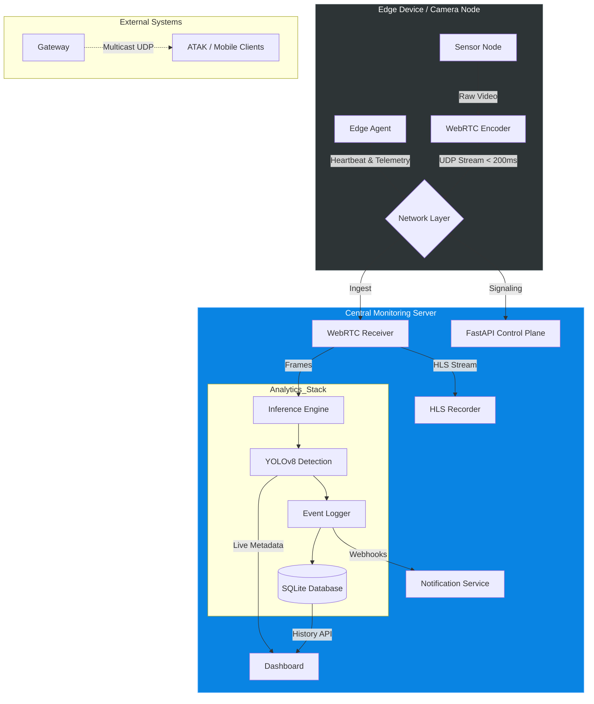

# Aegis: Distributed Real-Time Monitoring Platform

**A distributed microservices system for real-time operational visibility in bandwidth-constrained edge environments.**

## Overview

**Aegis** (repo: `sentinel`) is a modular monitoring architecture designed to bridge the gap between commercial IoT hardware and enterprise-grade centralized systems. Built for **resilience in unstable network conditions**, it decouples **Perception** (Edge Nodes) from **Cognition** (Central Server) to ensure continuous operation.

It enables sub-200ms video streaming, edge-computed Automated Object Recognition, and seamless data aggregation. Aegis is designed for industrial safety, remote infrastructure monitoring, and high-availability observational contexts.

---

## System Architecture

Aegis utilizes a **Split-Plane Architecture** to optimize network throughput. 
* **Data Plane (UDP):** High-volume video traffic uses WebRTC to minimize latency.
* **Control Plane (TCP):** Critical telemetry and hardware commands use reliable REST/WebSockets.



## Key Capabilities

### 1. Resilient "Watch" State Machine
When network connectivity is lost, the Edge Node automatically enters **Offline Recording** mode.
-   **Behavior**: Continues sampling locally and ensuring data continuity.
-   **Buffering**: Critical events are logged to a secure on-device buffer.
-   **Sync**: Logs are automatically resynchronized with the server upon reconnection.

### 2. Multi-Context Visualization
Switch seamlessly between **Global Overview** maps and high-fidelity **Indoor Floorplans** using a dynamic tile engine.
-   **Custom Maps**: Define map layers (Satellite, Blueprint, Drone Orthomosaic) in configuration.
-   **Contextual Assets**: Cameras appear only on relevant map layers (e.g., specific floors or zones).
-   **Live Symbology**: FOV cones provide immediate visual feedback on asset health and activity.

### 3. Real-Time Alerting & Intelligence
Aegis integrates with external communication platforms to ensure rapid response.
-   **Instant Notifications**: Webhook integration for Discord, Slack, or custom C2 interfaces.
-   **Intelligent Gating**: Filters false positives using Motion Vectors before running heavy AI inference.
-   **Metadata**: Alerts include confidence scores, object labels, and snapshot links.

### 4. Forensic Data Retention
All operational data is persisted for post-incident analysis.
-   **SQLite Backend**: High-performance, server-side database tracks every detection event (`sentinel.db`).
-   **Evidence Locker**: Full-resolution snapshots are stored and indexed by timestamp and track ID.
-   **Investigation Dashboard**: A dedicated interface for reviewing, filtering, and analyzing historical alerts.

### 5. "Digital Twin" Configuration
The operational environment is defined in `config/site_manifest.yaml`, serving as the **Single Source of Truth**.
-   **Schema**: Defines Assets, Spatial Data, and Network parameters.
-   **Dynamic**: The system parses this manifest to generate the monitoring layout dynamically.

---

## Quick Start

### Prerequisites
-   Python 3.10+
-   Webcam (for Edge Node)
-   Linux / macOS
-   FFmpeg (for HLS recording)

### Installation
```bash
# Clone the repository
git clone https://github.com/2vyy/sentinel.git
cd sentinel

# Install dependencies
pip install -r requirements.txt
```

### Running the Platform
The platform includes a master script `run.sh` to launch both the Central Server and the Edge Node.

```bash
# Run both Server and Camera (Full Stack)
./run.sh

# Run only the Server (Central Hub)
# Access UI at http://localhost:8000
./run.sh --server

# Run only the Camera (Edge Device)
./run.sh --camera
```

---

## Configuration

Modify `config/site_manifest.yaml` to match your deployment:

```yaml
site_name: "SITE_ALPHA"
maps:
  - id: "global"
    name: "Global Ops"
    type: "geospatial"
    center: [34.0522, -118.2437]
    zoom: 18

assets:
  - id: "CAM_01"
    connection: { ip: "0.0.0.0", protocol: "webrtc" }
    spatial:
      lat: 34.0522
      lon: -118.2437
      heading: 0      # 0 = North
      fov: 90         # Wide angle
    map_id: "global"
```

## Project Structure

```
Sentinel/
├── camera_node/            # Edge Logic (Producer)
│   ├── main.py             # WebRTC Signaling & Connection Logic
│   └── stream_manager.py   # Atomic Frame Capture
├── server_node/            # Server Logic (Consumer)
│   ├── core/               # Analytics Stack (YOLO, SQLite, AssetMgr)
│   ├── webrtc/             # Video Receiver & HLS Recorder
│   └── web/                # NiceGUI Frontend (Map, Video, History)
├── config/                 # YAML Manifests
├── assets/                 # Map Images & Static Resources
└── run.sh                  # Application Orchestrator
```